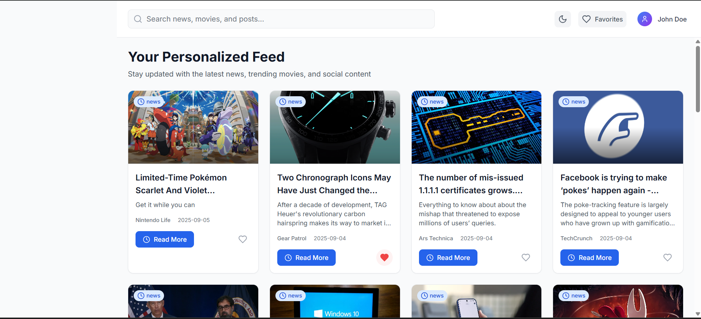
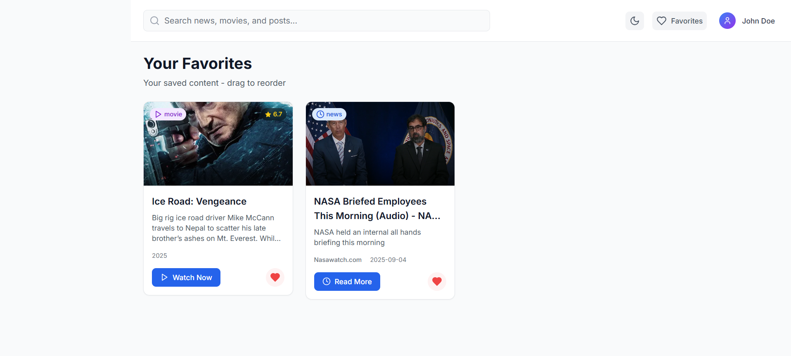
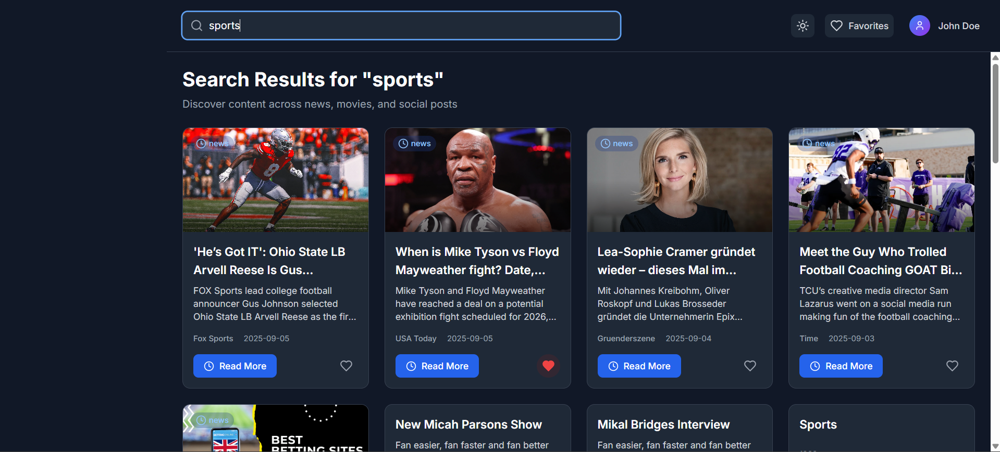

# 📊 Content Dashboard

A modern **Personalized Content Dashboard** built with **Next.js, TypeScript, Redux Toolkit, and TailwindCSS**.  
It aggregates news, movies, and mock social posts into a unified feed with personalization, dark mode, and interactive UI features.

---

## 🚀 Features
- Personalized Feed – Aggregates news, movies, and social posts
- Category Navigation – Feed, Trending, Favorites, Settings
- Interactive UI – Radix UI components, Framer Motion animations
- Favorites – Save and manage favorite items
- Drag-and-Drop – Reorder feed items
- Dark/Light Mode – Persistent theme toggle
- Search – Debounced search across APIs
- Responsive Layout – Works on desktop, tablet, and mobile
- Testing – Jest unit/integration + Cypress E2E

---

## 🛠 Tech Stack
- **Next.js 13** (App Router) + **React 18**
- **Redux Toolkit (RTK Query)**
- **TailwindCSS 3** + **Next Themes**
- **Framer Motion** (animations & drag/drop)
- **Radix UI / shadcn UI**
- **Recharts** (data visualization)
- **TypeScript**
- **Jest + React Testing Library**
- **Cypress** (E2E tests)

---

## 📂 Project Structure
```
content-dashboard/
 ├── components/         # Reusable UI components
 ├── pages/              # Next.js routes
 ├── store/              # Redux Toolkit slices
 ├── styles/             # Tailwind config
 ├── tests/              # Jest unit/integration tests
 ├── cypress/            # Cypress E2E tests
 ├── public/             # Static assets
 ├── package.json        # Dependencies & scripts
 └── .env.local          # Environment variables
```

---

## 🔑 APIs Used
- **News API** – `https://newsapi.org/v2/top-headlines?category=technology&apiKey=YOUR_API_KEY`
- **TMDB API** – `https://api.themoviedb.org/3/trending/movie/day?api_key=YOUR_API_KEY`
- **Social Posts** – `https://jsonplaceholder.typicode.com/posts`

---

## ⚙️ Installation & Setup
### 1. Clone Repository
```bash
git clone <repo-url>
cd content-dashboard
```

### 2. Install Dependencies
```bash
npm install
```

### 3. Setup Environment Variables
Create a `.env.local` file in the root:
```
NEWS_API_KEY=your_news_api_key
TMDB_API_KEY=your_tmdb_api_key
```

### 4. Run Development Server
```bash
npm run dev
```
App will be available at → [http://localhost:3000](http://localhost:3000)

---

## 🧪 Testing
### Unit & Integration Tests (Jest)
```bash
npm run test
```

### End-to-End Tests (Cypress)
```bash
npm run cypress:open
```

---

## 📸 Screenshots
(Add screenshots in `/public` folder and link them below)





---

## 🚀 Future Enhancements
- Integrate real-time APIs
- Add authentication & user profiles
- AI-driven recommendations
- PWA with offline support

---

## 📜 License
This project is licensed under the MIT License.
